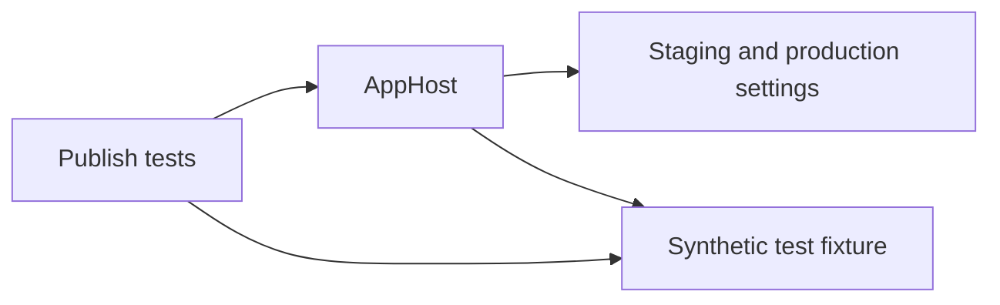

# CitizenId Status Deployment

`Arkanis.Infra.Deployment.CitizenId.Status` generates environment-isolated Kubernetes Helm charts for the CitizenId Kener status service.
The AppHost declares the web workload, CloudNativePG PostgreSQL, Redis persistence, ingress, availability controls, and External Secrets Operator resources.

## Project Graph



The AppHost defines the Kener Kubernetes resources.
The publish tests invoke it only as `Kubernetes-PublishTest` and supply one fixture from the test project through `KENER_PUBLISH_TEST_FIXTURE`.
The fixture contains synthetic identities; the AppHost rejects inherited deployment settings before loading it.
The tests run the non-mutating `emit-externalsecrets-kener-kubernetes` pipeline step and assert the deployment contract without connecting to Kubernetes or 1Password.
The step includes parameter processing, Kubernetes chart rendering, and External Secrets emission, but stops before Helm prerequisites and `helm-deploy-kener-kubernetes`.
Every test publish passes `--clear-cache true` to parameter processing, so cached Aspire deployment-state values cannot hide a missing ESO-generated credential or supply a live value.

## Initialize A Checkout

Use the .NET SDK selected by [`global.json`](global.json).
Restore local tools and install the repository Git hooks.

```powershell
dotnet tool restore
dotnet husky run --group init
dotnet husky install
dotnet restore Arkanis.Infra.Deployment.CitizenId.Status.slnx --locked-mode
```

## Build And Test

Run the deployment-model verification from the repository root.

```powershell
dotnet restore Arkanis.Infra.Deployment.CitizenId.Status.slnx --locked-mode
dotnet format Arkanis.Infra.Deployment.CitizenId.Status.slnx --verify-no-changes --verbosity diagnostic --no-restore
dotnet build Arkanis.Infra.Deployment.CitizenId.Status.slnx --configuration Release --no-restore
dotnet test tests/Arkanis.Infra.Deployment.CitizenId.Status.AppHost.PublishTests/Arkanis.Infra.Deployment.CitizenId.Status.AppHost.PublishTests.csproj --configuration Release --no-restore
```

The AppHost opts out of package lock generation because its Aspire SDK and publishing graph are operating-system dependent.
The publish tests use a package lock file.

## Publish Kener Kubernetes Charts

The AppHost produces one Helm chart for each deployment environment.
`Kubernetes-Production` targets `citizenid-status-production` at `https://status.citizenid.space`.
`Kubernetes-Staging` targets `citizenid-status-staging` at `https://status.citizenid.dev`.
The AppHost accepts staging and production for publication and validates their namespace, origin, database, owner, and credential source identities.
It loads conventional deployment settings with environment variables last and excludes `appsettings.local.json` from Kubernetes publication.
`Kener:Origin` also determines the ingress hostname, avoiding a second hostname setting.

```powershell
dotnet aspire publish --apphost src/Arkanis.Infra.Deployment.CitizenId.Status.AppHost/Arkanis.Infra.Deployment.CitizenId.Status.AppHost.csproj --environment Kubernetes-Production --output-path artifacts/kener-production --non-interactive
dotnet aspire publish --apphost src/Arkanis.Infra.Deployment.CitizenId.Status.AppHost/Arkanis.Infra.Deployment.CitizenId.Status.AppHost.csproj --environment Kubernetes-Staging --output-path artifacts/kener-staging --non-interactive
```

Publishing generates Helm artifacts only.
It does not create or resolve 1Password items, print secret values, apply Helm resources, or change the Kubernetes cluster.
The generated chart expects the configured ClusterSecretStores and existing CloudNativePG credentials secret at deployment time.
The [`postgres-production` infrastructure chart](https://github.com/ArkanisCorporation/Infrastructure/tree/main/kubernetes/infrastructure/postgres-production) provisions the `citizenid-status-production` and `citizenid-status-staging` roles and their matching source Secrets before a Kener deployment consumes them.
The app-local web database ExternalSecret refreshes every minute so it recovers promptly when its independently reconciled source Secret becomes available.

The tracked [`aspire.config.json`](aspire.config.json) selects this AppHost and disables default watch mode.
This keeps non-interactive AppHost publishing deterministic regardless of a developer or runner's global Aspire CLI setting.

The deployment renders a two-replica web workload with zone-preferred anti-affinity, a PodDisruptionBudget, health probes, explicit CPU and memory resources, and a persistent Redis StatefulSet.
The workload and Redis service names are `web` and `redis` respectively.
Redis passwords use only URI-unreserved symbols, so their raw value is valid in Kener's `REDIS_URL` user-info component.
The Redis password is `CreatedOnce` and is projected through the `redis-auth-generated-secrets` target Secret.
To rotate it, change the generated-credential identity, deploy the chart, and then roll out Redis and web.

## GitHub Actions

The workflow runs workflow linting, the shared .NET test and format contracts, a local complexity build, and semantic-release dry-run verification.
Candidate releases additionally validate the selected Kubernetes target before semantic-release creates the Git tag and GitHub release.
Published staging releases from `main` deploy through Aspire to `Kubernetes-Staging`.
Production promotion is manual-only through the `Deploy Production` workflow, which must run from the exact stable `vMAJOR.MINOR.PATCH` tag selected for deployment.

This repository does not publish a container image or NuGet package.
The deployment retains the independently pinned Kener and Redis image tags from the AppHost; a deployment-model release tag is not passed as a container image tag.

Configure the `release`, `k8s-staging`, and `k8s-production` GitHub Environments before the first delivery run.
Ordinary CI jobs use the manual `runner` choice when dispatched and otherwise use `vars.RUNNER_DEFAULT || 'daedalus'`, while Kubernetes verification and deployment jobs remain explicitly pinned to `arkanis-runners`.
The deployment environments must provide `KUBE_CONFIG` or have the target cluster context available on `arkanis-runners`.
Protect `k8s-production` with the required reviewers and deploy only from stable release tags.

See [GitHub Actions](docs/github-actions.md) for runner trust, permissions, and local validation details.

## Local Workflow Linting

Run the checksum-pinned Actionlint wrapper before committing workflow changes.

```powershell
dotnet run --file scripts/actionlint.cs
```

GitHub-hosted Actions remains the authoritative environment for validating reusable workflow resolution, permissions, artifact upload, and runner selection.

## Husky Tasks

The configured tasks live in [`.husky/task-runner.json`](.husky/task-runner.json).

```powershell
dotnet husky run --name dotnet-format
dotnet husky run --name dotnet-format-check
dotnet husky run --name dotnet-aspire-agent-init
```

The pre-commit group verifies .NET formatting without modifying source files.
