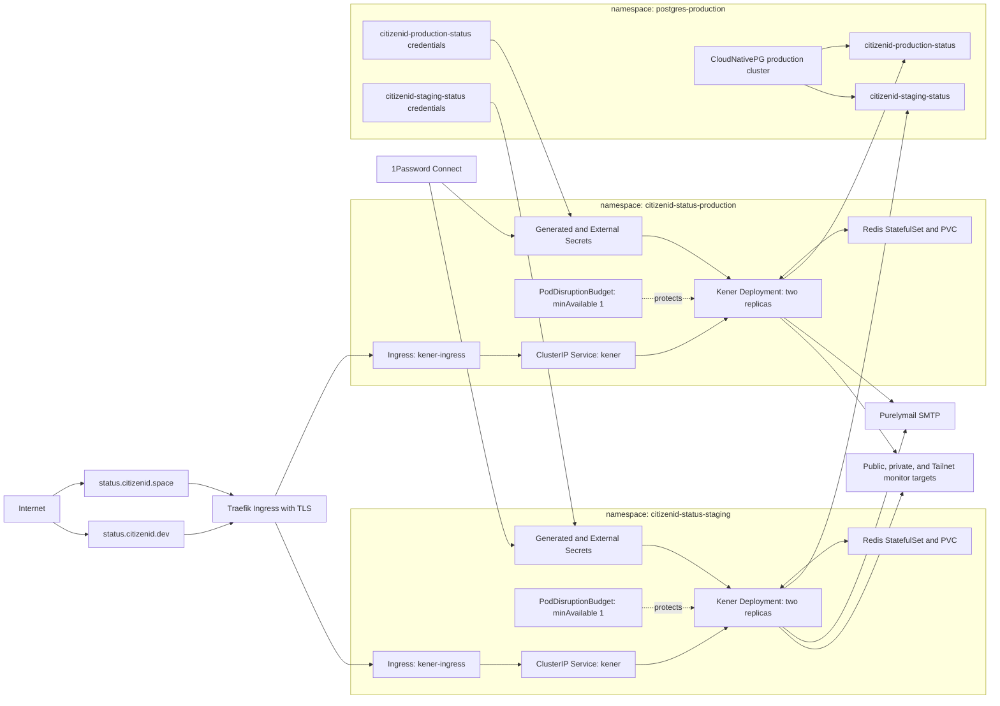

# Kener Production And Staging Kubernetes Deployment Design

## Objective

Deploy Kener v4.1.5 as public production and staging status and monitoring services.
Production serves `https://status.citizenid.space`.
Staging serves `https://status.citizenid.dev`.
The AppHost owns the generated Helm chart and all application-scoped Kubernetes resources.
Each publish targets exactly one environment-specific namespace.

## Scope

The implementation will configure the AppHost, production and staging deployment configuration, package references, and generated-manifest tests.
The implementation will not apply manifests to a live cluster, create a 1Password item, alter CloudNativePG, or change shared cluster operators.

The cluster must already provide CloudNativePG, External Secrets Operator, the `onepassword-connect` and `postgres-production-credentials` `ClusterSecretStore` resources, Stakater Reloader, the `letsencrypt-production` `ClusterIssuer`, Traefik, and the configured Longhorn storage class.
Those dependencies are repository-confirmed conventions and must be verified against the production cluster immediately before its first deployment.

## Environment Isolation

| Environment | Kubernetes namespace | Public origin | CloudNativePG database | Source credential metadata | Deployment configuration |
| --- | --- | --- | --- | --- | --- |
| Production | `citizenid-status-production` | `https://status.citizenid.space` | `citizenid-production-status` | `citizenid-production-status-credentials` | `appsettings.Kubernetes.Production.json` |
| Staging | `citizenid-status-staging` | `https://status.citizenid.dev` | `citizenid-staging-status` | `citizenid-staging-status-credentials` | `appsettings.Kubernetes.Staging.json` |

The AppHost selects one deployment environment per publish and emits one namespace-specific Helm chart.
Production and staging share resource names such as `kener`, `kener-redis-data`, `kener-database`, `kener-mail`, `kener-ingress`, and `kener-tls` only because those resources are namespace-scoped.
They never share a Redis StatefulSet, PVC, generated Kener or Redis secret, application database, or namespace-local ExternalSecret target.

## Resource Topology



All incoming public traffic terminates TLS at Traefik and reaches only the selected environment's Kener `ClusterIP` Service.
Kener itself has unrestricted outbound connectivity because monitors are explicitly allowed to target public, private, and Tailnet services.
That is an intentional administrative trust boundary, so only trusted Kener administrators may create or alter monitors.
Kener has no Kubernetes API permission or mounted service-account token.

## Kener Workload

The resource name is `kener`.
Both environments use `rajnandan1/kener:v4.1.5-alpine` until a separately reviewed image-digest pinning policy is introduced.
The application listens on port `3000` behind an internal `ClusterIP` Service.

Each Deployment has two replicas.
Kener uses PostgreSQL for shared durable state and BullMQ over Redis for shared scheduling and work distribution, which permits the two replicas to serve and run monitors concurrently.
Kener stores uploaded images in its database, so no shared Kener filesystem or ReadWriteMany volume is needed.

Each Kener pod starts with requests of `1` CPU and `1Gi` memory, matching Kener's small-production guidance.
Initial limits are `2` CPU and `2Gi` memory to contain a pathological monitor or Node.js memory growth while retaining room for normal bursts.
The Deployment uses a rolling update with `maxUnavailable: 0` and `maxSurge: 1`.

Kener uses `/healthcheck` for startup, liveness, and readiness probes.
The initial timing allows database migrations and Redis recovery before a pod is treated as failed.
The probes use the documented application endpoint rather than an arbitrary TCP-only check.

Each Deployment has a `PodDisruptionBudget` with `minAvailable: 1`.
Aspire's Kubernetes object model does not currently model a PodDisruptionBudget directly.
The AppHost adds a typed `policy/v1` PDB derived from `BaseKubernetesResource` to the Kener `KubernetesResource.AdditionalResources` collection.
This is the verified C# object-model mechanism for a chart-owned custom Kubernetes resource in the selected Aspire Kubernetes package.
The PDB selector matches the Deployment's explicit `app.kubernetes.io/component: kener` pod-template label.
This keeps the PDB versioned and chart-owned rather than maintained as an unmanaged sibling manifest.
It protects against voluntary disruptions only and does not guarantee availability during an application failure or rolling-update capacity loss.

### Scheduling

Pod anti-affinity is soft rather than required.
The primary preferred term has weight `100` and matches Kener's application-component label over `topology.kubernetes.io/zone`.
The secondary preferred term has weight `50` and matches the same label over `kubernetes.io/hostname`.

This gives zone separation precedence and uses a different host as a tie-breaker when a zone has multiple nodes.
The scheduler can still colocate replicas when the cluster is degraded, only one zone is schedulable, or a rollout surge would otherwise become Pending.
No required anti-affinity rule is emitted.

## Persistent Redis

Each environment has an application-local, namespace-scoped Redis `StatefulSet` with one replica.
It is not a Redis Cluster and no Redis operator is used.
Kener connects with one standard `REDIS_URL`, while Redis Cluster requires a cluster-aware client topology that Kener does not use.

Redis uses the CitizenId-compatible Redis `8-alpine` image with authentication, AOF enabled, `appendfsync everysec`, and normal snapshot persistence.
The environment-local `kener-redis-data` PVC mounts at `/data` with `ReadWriteOnce` access, initial `2Gi` capacity, and the configured Longhorn storage class.
The pod security context supplies the Redis filesystem group so the non-root Redis process can write the volume.

Redis has no externally exposed endpoint.
Its readiness and liveness checks authenticate before issuing `PING`.
Initial resource requests are `100m` CPU and `256Mi` memory, with limits of `500m` CPU and `512Mi` memory.

The single Redis member is a conscious availability tradeoff.
A node loss can pause monitor scheduling until the StatefulSet recovers, but AOF and the PVC preserve the queue and scheduler state without incorrectly modeling a single-node Kener client as a sharded Redis deployment.

## PostgreSQL

The AppHost creates the selected environment's CloudNativePG `Database` against the production cluster in `postgres-production`.
Production creates `citizenid-production-status` and staging creates `citizenid-staging-status`.
The database role credential source remains the existing `postgres-production-credentials` `ClusterSecretStore`.
The source credential metadata is environment-specific as defined in the environment-isolation table.
The generated namespace-local application Secret is named `kener-database` and exposes the `DATABASE_URL` key.

Kener accepts only a URI whose scheme is `postgresql`.
The CloudNativePG extension's default Npgsql connection-string template is therefore not valid for Kener and must not be injected.
The credentials configuration uses the extension's supported complete-template override instead.

```text
Production: {{ `postgresql://{{ .username | urlquery }}:{{ .password | urlquery }}@{{ .host }}:{{ .port }}/citizenid-production-status` }}
Staging:    {{ `postgresql://{{ .username | urlquery }}:{{ .password | urlquery }}@{{ .host }}:{{ .port }}/citizenid-staging-status` }}
```

The selected environment's configuration supplies its database name before the AppHost renders the corresponding Helm raw string.
Each outer expression preserves the inner External Secrets Operator expressions.
The ESO `urlquery` transformation percent-encodes generated credentials before they become URI user-info.
This retains strong generated passwords without introducing URI parsing failures.

The typed `WithKubernetesConnectionString` reference is customized to inject that Secret key as `DATABASE_URL` rather than as a `.NET` `ConnectionStrings__...` variable.
The existing `WithReference(db, "")` shape is removed because it cannot supply Kener's required URI contract.

Kener's default pool maximums would allow up to 30 PostgreSQL connections across two replicas.
Each environment explicitly sets `DATABASE_POOL_MAX=5` and `DATABASE_WORKER_POOL_MAX=3`, yielding a bounded maximum of 16 connections across both replicas.
The production CloudNativePG connection budget must retain capacity above the combined environment bounds for migrations, administration, and other tenants.

## Secrets and Configuration

No Kener secret needs a dedicated 1Password item merely to survive Helm release recreation.
Kubernetes External Secrets Operator is the owner of all Kubernetes Secret material.

| Consumer | Secret source | Delivered configuration | Lifecycle |
| --- | --- | --- | --- |
| Kener cryptographic key | Environment-local ESO `PasswordGenerator` | `KENER_SECRET_KEY` | `CreatedOnce` |
| Redis authentication | Environment-local ESO `PasswordGenerator` | Redis password and URI-authenticated `REDIS_URL` | `CreatedOnce` |
| PostgreSQL | Environment-specific CloudNativePG role Secret through `postgres-production-credentials` | `DATABASE_URL` | Source-controlled rotation |
| Purelymail | Existing 1Password entry through `onepassword-connect` into each namespace | `SMTP_USER`, `SMTP_PASSWORD`, and `SMTP_SENDER` | 1Password-controlled rotation |

`KENER_SECRET_KEY` is an application cryptographic root, not an integration credential.
Unexpectedly changing it can invalidate state created under the old value, so it must stay stable within its environment across pod recreation, Helm upgrades, and normal operator restarts.
An ESO-generated `CreatedOnce` Secret is the correct owner and persistence mechanism for that requirement.
Deleting or intentionally regenerating it is a deliberate credential-rotation event, not normal release behavior.

For local non-Kubernetes orchestration only, `Use1PasswordAsync("arkaniscorp.1password.com")` resolves the canonical `op://` parameter references without exposing values in source control.
During Kubernetes publishing, the AppHost does not invoke the 1Password CLI and does not read the values.
`WithExternalSecrets(ExternalSecretsOptions.FromConfiguration(builder.Configuration))` emits the ExternalSecret resources using the existing `onepassword-connect` `ClusterSecretStore`.
Typed Secret references add the Reloader annotation so a source-secret rotation restarts Kener safely.

The existing Purelymail item maps its `username` field to both `SMTP_USER` and, by default, `SMTP_SENDER`.
Its `password` field maps to `SMTP_PASSWORD`.
The non-secret mail settings are `SMTP_HOST=smtp.purelymail.com`, `SMTP_PORT=465`, and `SMTP_SECURE=1`.
If the stored username is not an authorized sender address, `SMTP_SENDER` must be overridden with an authorized non-secret From address before deployment.

Production requires `ORIGIN=https://status.citizenid.space` and staging requires `ORIGIN=https://status.citizenid.dev` for their public-origin and CSRF behavior.
The deployment uses the root path and does not set `KENER_BASE_PATH`.
No OIDC, webhook, analytics, CAPTCHA, or monitor-target credential is provisioned until Kener is configured to use that integration.

## Public Ingress

The resource-local ingress is named `kener-ingress`.
Production serves `status.citizenid.space` at path `/` with TLS secret `kener-tls` in `citizenid-status-production`.
Staging serves `status.citizenid.dev` at path `/` with its own namespace-local `kener-tls` secret in `citizenid-status-staging`.
The ingress uses the existing `letsencrypt-production` cluster issuer.
The Kener Service, Redis StatefulSet, Redis PVC, ExternalSecrets, and PDB remain namespace-scoped and have no cross-namespace dependencies.

## AppHost and Configuration Shape

The AppHost adds direct package references for the Aspire Redis and Kubernetes publishers, the base Arkanis Kubernetes extension, and the Arkanis 1Password extension.
The Kubernetes publisher version is aligned to the `13.5.4` AppHost package line, specifically `Aspire.Hosting.Kubernetes` `13.5.4-preview.1.26464.4`.
The dependency lock and central package versions are updated together and verified by restore.

`appsettings.Kubernetes.Production.json` and `appsettings.Kubernetes.Staging.json` are the deployment configuration files added for this task.
Each holds its selected namespace, image tag, ingress host and TLS secret, CloudNativePG source and destination Secret metadata, External Secrets stores and generators, PersistentVolumeClaim details, and non-secret runtime environment values.
Neither contains secret values or 1Password item values.

The AppHost loads the selected Kubernetes environment configuration before creating resources.
It creates one Kubernetes environment only when publishing a Kubernetes deployment.
It uses resource-local APIs for ingress, the Redis PVC, CloudNativePG credentials, and ExternalSecrets rather than environment-wide legacy discovery.

## Verification

Implementation starts with generated-manifest tests before the AppHost behavior is changed.
The tests inspect the rendered Helm chart and must prove all of the following.

- A production chart has namespace exactly `citizenid-status-production`, Ingress host exactly `https://status.citizenid.space/`, and database exactly `citizenid-production-status`.
- A staging chart has namespace exactly `citizenid-status-staging`, Ingress host exactly `https://status.citizenid.dev/`, and database exactly `citizenid-staging-status`.
- Each chart requests TLS through `letsencrypt-production` and has no resource reference to the other environment's namespace, database name, generated secret, Redis PVC, or ingress host.
- Kener is a two-replica Deployment with the documented resource requests, rolling-update values, health probes, PDB, and two weighted preferred anti-affinity terms in each environment.
- Each PDB is `policy/v1`, has `minAvailable: 1`, and selects the explicit `app.kubernetes.io/component: kener` workload label.
- The zone term has weight `100`, the hostname term has weight `50`, and no required pod anti-affinity term exists.
- Redis is a one-replica StatefulSet with no externally reachable Service, authenticated probes, persistent `/data` PVC mount, AOF arguments, and no Redis Cluster resources in each environment.
- The CloudNativePG connection Secret injects a `postgresql://` `DATABASE_URL` with ESO `urlquery` password encoding and the selected database name.
- Each mail Secret maps only the existing 1Password username and password fields to Kener's documented SMTP variable names.
- The emitted charts contain ExternalSecret and PasswordGenerator resources but no resolved `op://` value, plaintext mail credential, database password, Redis password, or Kener key.
- All Secret-consuming workloads receive the Reloader auto-restart annotation.

Local verification requires `dotnet restore`, `dotnet build`, the generated-manifest test suite, `dotnet format --verify-no-changes` if the repository baseline supports it, and `git diff --check`.
No implementation verification command applies a manifest, pushes an image, creates a 1Password item, or changes the live cluster.

Staging acceptance is an operator-run rollout followed by probe inspection, SMTP test-message verification, one private and one public monitor check, and a two-replica scheduling observation.
The scheduling observation must confirm that Kener maintains one shared schedule, rather than creating duplicate monitor executions, while pods are placed in different zones when the cluster can satisfy that preference.
Production acceptance repeats the same checks after staging has established the environment-specific chart and the deployment procedure.
